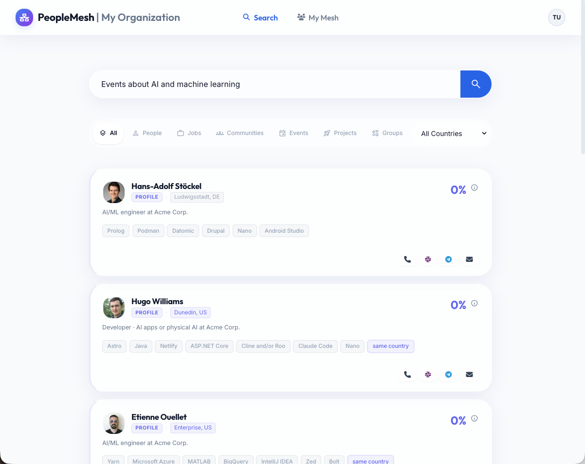
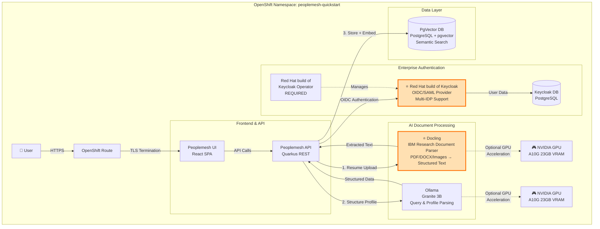
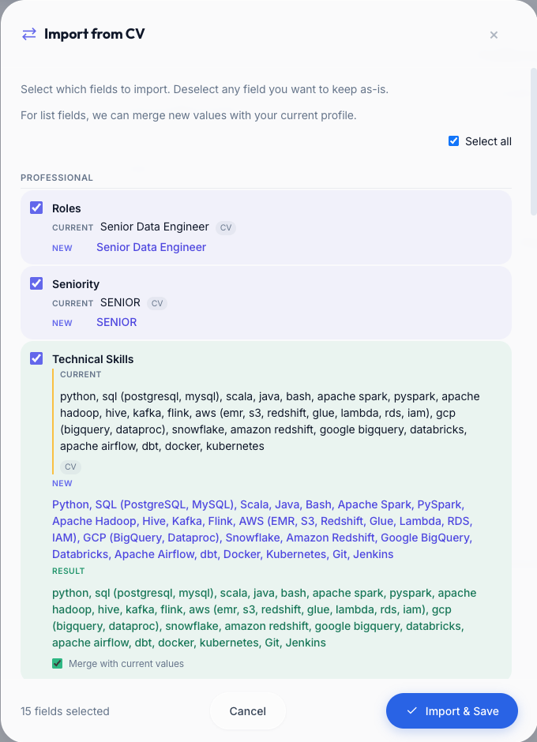

# Deploy AI-powered talent discovery with semantic search

Learn to build semantic search that finds talent by meaning, not keywords, using Keycloak, Docling, and embeddings on OpenShift.

## Table of Contents

- [Detailed Description](#detailed-description)
  - [See it in Action](#see-it-in-action)
  - [Architecture](#architecture)
- [Requirements](#requirements)
  - [Hardware Requirements](#hardware-requirements)
  - [Software Requirements](#software-requirements)
- [Deploy](#deploy)
  - [Quick Start](#quick-start)
  - [GPU Acceleration (Optional but highly recommended)](#gpu-acceleration-optional)
  - [Verify Deployment](#verify-deployment)
  - [Delete](#delete)
- [Using the Application](#using-the-application)
- [Advanced Configuration](#advanced-configuration)
- [Reference](#reference)
- [Tags](#tags)

## Detailed Description

Organizations struggle to connect the right people with the right opportunities. Traditional directory searches rely on exact keyword matches, missing talented individuals whose skills are described differently or whose expertise lies hidden in résumés and project histories. This creates missed opportunities for staffing projects, forming teams, and leveraging existing organizational knowledge.

This quickstart deploys **Peoplemesh**, an AI-powered talent discovery platform that uses semantic search and vector embeddings to understand the meaning behind searches, not just keywords. When someone searches for "mobile developer in Italy," the system understands related concepts like "iOS engineer," "Android developer," and geographic variations, surfacing the best matches even when exact words don't match. It leverages **Docling**, IBM Research's open-source document understanding platform, to intelligently parse résumés in multiple formats (PDF, DOCX, images) and extract structured information, while **Red Hat build of Keycloak** provides enterprise-grade authentication with support for multiple identity providers.

The platform enables organizations to find hidden talent, build diverse teams, identify skill gaps, and connect people with relevant opportunities—all through a simple search interface powered by open-source AI. Whether staffing a critical project, building a community of practice, or identifying mentors, Peoplemesh helps you find the right people quickly.

### See it in Action



**Key Features:**
- 🔍 **Semantic Search**: Find people by skills, experience, location, or any combination using natural language
- 📄 **Intelligent Document Processing**: **Docling** (IBM Research) automatically parses résumés in any format—PDFs, Word docs, even scanned images—with intelligent layout detection and structure preservation
- 🎯 **Smart Matching**: Vector embeddings understand "data scientist" matches "ML engineer" and "machine learning specialist"
- 🌍 **Geographic Intelligence**: Understands locations, time zones, and work mode preferences
- 🔐 **Enterprise Authentication**: **Red Hat build of Keycloak** provides production-ready authentication with OIDC/SAML, multi-factor authentication, user federation, and support for Google, Microsoft, LDAP, and custom identity providers

### Architecture



**Components:**
- **Peoplemesh Application**: React frontend + Quarkus backend serving the search interface and REST API
- **Red Hat build of Keycloak**: Enterprise authentication server providing OIDC/SAML support, user management, and integration with external identity providers (Google, Microsoft, LDAP, etc.)
- **Docling**: IBM Research's document understanding platform that intelligently parses résumés and documents, extracting text from PDFs, DOCX, images, and other formats with layout awareness and structure preservation
- **PostgreSQL + pgvector**: Vector database for semantic search using embeddings
- **Ollama** (or vLLM): Local LLM for query parsing and résumé processing

**Data Flow:**
1. User uploads résumé → **Docling** intelligently parses document structure and extracts text → LLM structures profile → Stored with vector embeddings
2. User searches "mobile developer" → LLM parses intent → Vector similarity search → Ranked results
3. Authentication flow → **Red Hat build of Keycloak** OIDC → Session management → Secure API access

## Requirements

### Hardware Requirements

**Minimum (CPU-only):**
- **CPU**: 4 cores
- **Memory**: 16 GB RAM
- **Storage**: 100 GB available (50 GB for models, 50 GB for databases)

**Recommended (with GPU acceleration for 10-20x faster performance):**
- **CPU**: 8 cores
- **Memory**: 32 GB RAM
- **GPU**: 1x NVIDIA GPU with 16GB+ VRAM (A10G, T4, V100, or better)
- **Storage**: 150 GB available

**Notes:**
- CPU-only mode works but résumé processing takes 2-3 minutes per upload
- With GPU: résumé processing completes in 10-20 seconds
- GPU requires NVIDIA GPU Operator installed on cluster

### Software Requirements

**Required:**
- **OpenShift**: 4.12 or later
- **Helm**: 3.x
- **oc CLI**: Matching your OpenShift version
- **Red Hat build of Keycloak Operator**: 24.0 or later

**IMPORTANT - Keycloak Operator Installation:**

The **Red Hat build of Keycloak Operator** must be installed in the **target namespace** (where you'll deploy Peoplemesh) before running helm install.

**Install the operator:**
1. OpenShift Console → OperatorHub
2. Search for "Red Hat build of Keycloak"
3. Click "Install"
4. **Installation Mode**: Select "A specific namespace on the cluster"
5. **Installed Namespace**: Choose or create the namespace where you'll deploy Peoplemesh (e.g., `peoplemesh-quickstart`)
6. Click "Install"
7. Wait for the operator to show "Succeeded" status

**Verify operator is running in your target namespace:**
```bash
oc get csv -n peoplemesh-quickstart | grep rhbk-operator
# Should show: rhbk-operator.v24.x.x   Red Hat build of Keycloak   24.x.x   Succeeded
```

**Why namespace-scoped?** This deployment creates Keycloak custom resources (CRs) that the operator watches. The operator must be in the same namespace to manage these resources.

## Deploy

### Quick Start

**1. Install Keycloak Operator:**

The **Red Hat build of Keycloak Operator** must be installed in the target namespace **before** deploying.

```bash
# Create the namespace
oc new-project peoplemesh-quickstart

# Install the operator from OperatorHub:
# 1. OpenShift Console → OperatorHub
# 2. Search for "Red Hat build of Keycloak"
# 3. Click "Install"
# 4. Installation Mode: "A specific namespace on the cluster"
# 5. Installed Namespace: Select "peoplemesh-quickstart"
# 6. Click "Install" and wait for "Succeeded" status
```

**2. Clone the repository:**
```bash
git clone https://github.com/rh-ai-quickstart/peoplemesh-quickstart.git
cd peoplemesh-quickstart/peoplemesh-umbrella
```

**3. Build helm dependencies:**
```bash
helm dependency update
```

**Note:** If you make any changes to the helm charts (e.g., updating values in `charts/keycloak/`, `charts/pgvector/`, etc.), you **must** run `helm dependency update` again before deploying. This repackages the updated charts into the umbrella chart.

**4. Deploy:**
```bash
# Simple installation - all secrets auto-generated
./install.sh \
  --namespace peoplemesh-quickstart \
  --test-password YourSecurePassword
```

The script automatically generates all required secrets securely. Only the namespace and test user password need to be provided.

**With GPU acceleration:**
```bash
./install.sh \
  --namespace peoplemesh-quickstart \
  --test-password YourSecurePassword \
  --ollama-gpu true \
  --docling-gpu true
```

**Full options:**
```bash
./install.sh --help
```

**Manual Helm installation:**
If you prefer to use Helm directly without the script, see [INSTALL.md](INSTALL.md) for the complete Helm command with all parameters.

**5. Get the application URL:**
```bash
echo "Application URL: https://$(oc get route peoplemesh -n peoplemesh-quickstart -o jsonpath='{.spec.host}')"
```

**6. Access the application:**
- Open the URL in your browser
- Click "Sign In"
- Choose "Continue with Keycloak"
- Login with:
  - Username: `testuser@example.com`
  - Password: (the password you set during installation)

**Deployment time:** ~10-15 minutes (models and images download on first install)


**GPU Requirements:**
- At least 1 NVIDIA GPU available in cluster (2 if you are accelerating both docling and embedding generation to drive recommendations)
- NVIDIA GPU Operator installed
- GPU tolerations pre-configured (works with common taints like `nvidia.com/gpu`, `g5-gpu`)

See [GPU-SETUP.md](GPU-SETUP.md) for detailed GPU configuration.

### Verify Deployment

**Check all pods are running:**
```bash
oc get pods -n peoplemesh-quickstart
```

Expected output:
```
NAME                             READY   STATUS    RESTARTS   AGE
docling-xxx                      1/1     Running   0          5m
keycloak-0                       1/1     Running   0          5m
keycloak-postgres-db-0           1/1     Running   0          5m
ollama-0                         1/1     Running   0          5m
peoplemesh-xxx                   1/1     Running   0          5m
pgvector-0                       1/1     Running   0          5m
```

**Test the application:**
```bash
# Health check
curl -k "https://$(oc get route peoplemesh -n peoplemesh-quickstart -o jsonpath='{.spec.host}')/q/health/ready"

# Should return: {"status":"UP"}
```

**Verify GPU allocation (if enabled):**
```bash
oc describe pod ollama-0 -n peoplemesh-quickstart | grep nvidia.com/gpu
# Should show: nvidia.com/gpu: 1 (in both Requests and Limits)
```

### Delete

To completely remove the deployment and all data:

```bash
# Simple uninstall
./uninstall.sh --namespace peoplemesh-quickstart
```

This removes the Helm release and all components. The namespace itself remains (see note in uninstall output to delete it completely if desired).

**Manual uninstall:**
```bash
# Uninstall the helm release
helm uninstall peoplemesh -n peoplemesh-quickstart

# Optionally delete the namespace (removes all persistent volumes and data)
oc delete namespace peoplemesh-quickstart
```

**Warning:** This permanently deletes all data including:
- All user profiles and uploaded résumés
- Search history and analytics
- Database contents
- Keycloak users and configuration

**Note on Reinstallation:** If you reinstall the quickstart after uninstalling, you may encounter login errors due to stale browser cookies. To resolve this:
1. Clear your browser cookies for the Peoplemesh domain, OR
2. Open the browser developer tools (F12) → Application/Storage → Cookies → Delete cookies starting with `peoplemesh`

## Using the Application

### Upload a Résumé

**Powered by Docling** - IBM Research's intelligent document parser that understands document structure and layout:

1. Click your profile icon → "My Profile"
2. Click "Upload CV"
3. Select a résumé (PDF, DOCX, or image format)
4. **Docling processes the document:**
   - Detects document layout and structure
   - Extracts text while preserving formatting
   - Handles multi-column layouts, tables, and headers
   - Processes scanned documents and images (OCR)
5. AI structures the extracted text into profile fields
6. Wait 10-20 seconds (GPU) or 2-3 minutes (CPU) for complete processing
7. Review extracted information and click "Apply Changes"

**Example: Docling Document Processing Output**



*Docling intelligently extracts structured content from résumés, preserving layout and formatting for accurate AI processing.*

**Supported formats:** PDF, DOCX, TXT, PNG, JPG (images/scanned documents)

**Docling advantages:**
- ✅ Intelligent layout detection (handles complex résumé formats)
- ✅ Table extraction (work history, education sections)
- ✅ Multi-language support
- ✅ Scanned document support with OCR
- ✅ GPU acceleration for faster processing

### Search for People

**Example searches:**
- `data engineer with Python experience`
- `mobile developer in Italy`
- `senior architect who speaks Italian`
- `machine learning engineer with 5+ years experience`

**Search features:**
- Semantic matching finds related terms (e.g., "ML" matches "machine learning")
- Location-aware (understands cities, countries, regions)
- Experience level filtering (junior, mid, senior, lead)
- Language requirements
- Industry experience

**Score breakdown:** Click the ℹ️ icon next to each result to see how the score was calculated (semantic similarity, must-have skills, location match, etc.)

### Add Additional Users

Keycloak admin console:
```bash
echo "Keycloak URL: https://$(oc get route keycloak -n peoplemesh-quickstart -o jsonpath='{.spec.host}')"
# Default admin credentials are auto-generated - check keycloak-admin-secret
```

## Advanced Configuration

For advanced configuration options including:
- Custom organization branding
- Additional OIDC providers (Google, Microsoft)
- Storage and resource customization
- Complete parameter reference

See [INSTALL.md](INSTALL.md) for detailed configuration guide.

## Reference

**Project Documentation:**
- [Installation Guide](INSTALL.md) - Complete installation reference with all configuration options
- [GPU Setup Guide](GPU-SETUP.md) - Detailed GPU configuration and troubleshooting
- [Deployment Summary](docs/QUICKSTART-SUMMARY.md) - Architecture decisions and design rationale
- [Logout Fix Documentation](docs/LOGOUT-FIX.md) - OIDC logout implementation details

**Upstream Projects:**
- [Peoplemesh GitHub](https://github.com/francescopace/peoplemesh) - Main application repository
- [Peoplemesh Documentation](https://github.com/francescopace/peoplemesh/blob/main/docs/how-to/deploy-openshift-helm.md) - Upstream deployment guide

**Key Technologies Featured in This Quickstart:**

**Red Hat build of Keycloak:**
- [Product Page](https://access.redhat.com/products/red-hat-build-of-keycloak) - Enterprise authentication and authorization
- [Operator Documentation](https://access.redhat.com/documentation/en-us/red_hat_build_of_keycloak) - Installation and configuration guide
- [Keycloak Project](https://www.keycloak.org/documentation) - Upstream Keycloak documentation

**Docling (IBM Research):**
- [Docling GitHub](https://github.com/DS4SD/docling) - Document understanding and parsing
- [Docling Documentation](https://ds4sd.github.io/docling/) - API reference and usage guide
- [Research Paper](https://arxiv.org/abs/2408.09869) - Technical deep dive on document AI

**Additional Technologies:**
- [pgvector](https://github.com/pgvector/pgvector) - PostgreSQL extension for vector similarity search
- [Ollama](https://ollama.ai/) - Local LLM runtime
- [LangChain4j](https://docs.langchain4j.dev/) - Java LLM framework

**Related AI Quickstarts:**
- [OpenShift AI Quickstarts](https://ai-on-openshift.io/odh-rhoai/configuration/) - Additional AI deployment patterns
- [Red Hat AI Quickstart Catalog](https://github.com/rh-ai-quickstart) - Browse all quickstarts

## Tags

* **Industry:** Media and IT services
* **Use Cases:** Human Resources, Talent Discovery, Skills Management, Team Building, Knowledge Management
* **Technologies:** Vector Search, Semantic Search, LLM, RAG, OIDC Authentication
* **AI/ML:** Natural Language Processing, Embeddings, Retrieval-Augmented Generation
