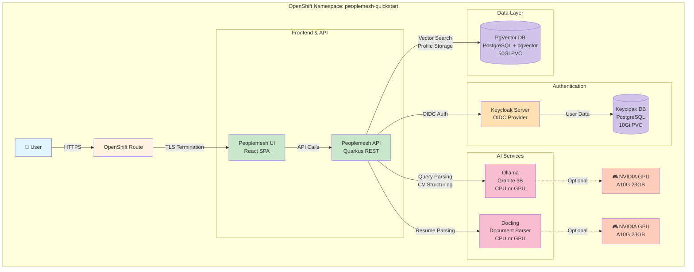

# Architecture Diagram

Since this is a text-based environment, here's a Mermaid diagram that should be converted to PNG for the README:



## Component Details

**Peoplemesh Application:**
- Frontend: React single-page application
- Backend: Quarkus (Java) REST API
- Handles search queries, profile management, authentication flow

**Keycloak:**
- OIDC authentication provider
- User management and SSO
- Supports multiple identity providers (Google, Microsoft, etc.)

**Ollama:**
- Local LLM runtime (Granite 3B model)
- Parses search queries into structured filters
- Extracts structured data from résumé text
- Optional GPU acceleration (10-20x faster)

**Docling:**
- Converts PDFs/DOCX to markdown text
- Extracts text from résumés
- Optional GPU acceleration for faster processing

**PgVector Database:**
- PostgreSQL with pgvector extension
- Stores user profiles and vector embeddings
- Semantic similarity search using cosine distance

**Data Flow:**

1. **Search Flow:**
   ```
   User → UI → API → Ollama (parse query) → PgVector (vector search) → API → UI
   ```

2. **Resume Upload Flow:**
   ```
   User → UI → API → Docling (PDF→text) → Ollama (text→structured) → PgVector (store) → API → UI
   ```

3. **Authentication Flow:**
   ```
   User → UI → Keycloak (login) → OIDC callback → API (session) → UI
   ```

## Deployment Options

**CPU-Only Mode:**
- Works on any OpenShift cluster
- No GPU required
- Resume processing: 2-3 minutes per upload
- Search queries: 5-10 seconds

**GPU Mode:**
- Requires NVIDIA GPU nodes
- Resume processing: 10-20 seconds per upload
- Search queries: 1-2 seconds
- Both Ollama and Docling can share same GPU or use separate GPUs

## Network Flow

```
Internet
   ↓
OpenShift Router (HAProxy)
   ↓
Route (TLS termination)
   ↓
Service (ClusterIP)
   ↓
Pod (Peoplemesh)
   ↓
Internal Services (Keycloak, Ollama, Docling, PgVector)
```

All external traffic goes through HTTPS. Internal traffic uses ClusterIP services within the namespace.
