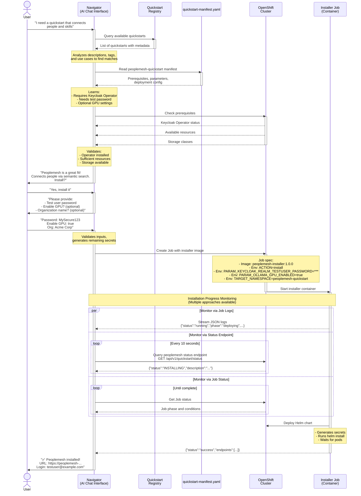
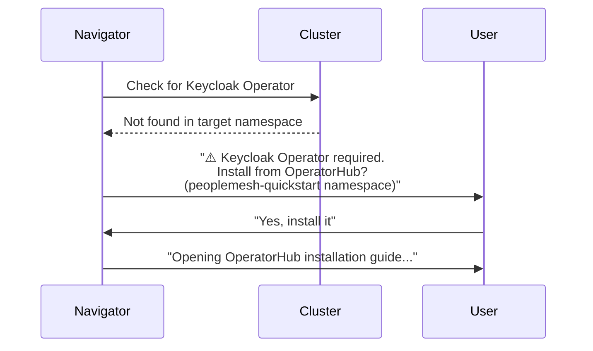

# Typical Deployment Sequence for Peoplemesh

## Sequence Diagram



## Key Points

### Discovery Phase (Steps 1-3)
- Navigator uses **semantic understanding** to match user intent with quickstart capabilities
- **Registry** provides high-level metadata (tags, descriptions, use cases)
- **Manifest** provides detailed deployment requirements and configuration
- Navigator conserves its context by retrieving only the manifests it needs 

### Validation Phase (Step 4)
Navigator checks cluster state before suggesting installation:
- Required operators (Keycloak Operator in target namespace)
- Resource availability (CPU, memory, GPU if requested)
- Storage classes (ReadWriteOnce volumes)
- OpenShift version compatibility

### Parameter Collection (Steps 7-8)
Navigator asks for **minimal user input**:
- It's not necessary to expose every deployment option the quickstart has.
- Quickstarts can simplify their parameter surface by wrapper helm, etc. with a shell script (this is an internal quickstart detail)
- **Required**: Test user password (for demo login)
- **Optional**: GPU acceleration flags
- **Optional**: Organization customization
- **Auto-generated**: All 6 internal secrets (DB passwords, encryption keys)

### Installation Execution (Step 9)
Navigator creates a Kubernetes **Job** that runs the installer container:

```yaml
apiVersion: batch/v1
kind: Job
metadata:
  name: peoplemesh-installer-xyz
  namespace: navigator-system
spec:
  template:
    spec:
      containers:
      - name: installer
        image: ghcr.io/rh-ai-quickstart/peoplemesh-installer:1.0.0
        env:
        - name: ACTION
          value: "install"
        - name: TARGET_NAMESPACE
          value: "peoplemesh-quickstart"
        - name: INSTALL_MODE
          value: "demo"
        - name: PARAM_KEYCLOAK_REALM_TESTUSER_PASSWORD
          value: "MyPassword"
        - name: PARAM_OLLAMA_GPU_ENABLED
          value: "true"
      restartPolicy: Never
```

### Progress Monitoring (Step 10)
Navigator has **multiple approaches** to monitor installation progress:

#### 1. **Job Log Streaming** (Real-time)
- Installer outputs structured JSON to stdout
- Navigator streams and parses log lines
- Example: `{"status":"running","phase":"deploying","message":"Installing Helm chart..."}`

#### 2. **Status Endpoint Polling** (Post-deployment)
- After pods are running, query `/api/v1/quickstart/status`
- Returns operational health of deployed components
- Defined in `quickstart-manifest.yaml` status section

#### 3. **Job Status API** (Kubernetes-native)
- Query Job resource conditions and phase
- Reliable but less detailed than structured logs

**Recommended**: Combine approaches:
- Use **log streaming** during active installation
- Use **status endpoint** for ongoing health monitoring
- Use **Job status** as fallback/validation
- Do we need the status deployment action?

## Error Handling

If installation fails, Navigator receives error details via:
1. **Job logs**: `{"status":"error","message":"Keycloak Operator not found"}`
2. **Job status**: `Failed` condition with reason
3. **Exit code**: Container exit code (0=success, 1=error, 2=prerequisites failed)

Navigator can then:
- Report specific error to user
- Suggest remediation (e.g., "Install Keycloak Operator first")
- Offer to retry or clean up

## Prerequisites Not Met

If prerequisites check fails (Step 4):



Navigator guides user through prerequisite installation before proceeding.